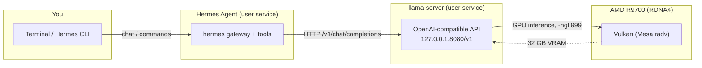

# Running Qwen3.8-27B locally on a Dell T7820 + AMD Radeon AI PRO R9700

A developer guide to running a 27B LLM entirely on a local AMD GPU (RDNA4),
serving it as an OpenAI-compatible API, and wiring an AI agent (Hermes) to it
for coding and system work. No cloud, no NVIDIA, no ROCm — just the kernel
`amdgpu` driver + Mesa's Vulkan driver (`radv`) + a prebuilt Vulkan build of
llama.cpp.

> **Target hardware:** Dell Precision T7820 (dual-socket Xeon) with a
> **Radeon AI PRO R9700** (Navi 48, RDNA4, ~32 GB VRAM) in a PCIe slot.
> **OS:** Ubuntu 26.04 LTS.
> **Model:** Qwen3.8-27B, GGUF `Q4_K_XL` (~17 GB) + a small MTP draft model for
> speculative decoding.

---

## The big picture

Everything runs locally and talks over `localhost`. The LLM never leaves the box.



Why this stack works on an AMD 9000-series card:

- **No ROCm needed.** llama.cpp ships a **Vulkan** build that uses the free
  Mesa `radv` Vulkan driver, which fully supports RDNA4. This avoids the
  ROCm "is my GPU supported?" rabbit hole entirely.
- **Prebuilt binary.** We download a compiled `llama.cpp` release (no local
  build step), so there's nothing to compile.
- **Speculative decoding (MTP).** Qwen3.8 ships a tiny Multi-Token-Prediction
  draft model; llama.cpp uses it to predict 2 tokens ahead, cutting latency.
- **systemd user service.** The server survives terminal closes, restarts on
  crash, and needs no root.

---

## 1. Prerequisites

Base tooling (build tools are only needed if you ever rebuild; the prebuilt
binary needs none of them, but they're cheap to have):

```
sudo apt update
sudo apt install -y build-essential git tmux python3 python3-pip
```

Confirm the GPU is present and the kernel driver is loaded:

```
lspci -nn | grep -iE 'vga|display'
# → ... [AMD/ATI] Navi 48 [Radeon AI PRO R9700] [1002:7551]

lsmod | grep amdgpu          # should list amdgpu
ls /dev/dri/                 # should show card0/card1 + renderD128
```

If `amdgpu` isn't loaded, `sudo modprobe amdgpu` and re-check.

---

## 2. AMD driver + Vulkan

On modern Ubuntu the **kernel `amdgpu` driver** and the **Mesa Vulkan driver
(`radv`)** are both just apt packages — there is no separate "AMD driver
installer" to run.

```
# Kernel driver (DKMS) + firmware
sudo apt install -y amdgpu-dkms amdgpu-dkms-firmware

# Mesa graphics stack: Vulkan (radv) + GL
sudo apt install -y mesa-vulkan-drivers libgl1-mesa-dri

# Handy verification tools
sudo apt install -y vulkan-tools rocm-smi nvtop
```

Verify the Vulkan driver actually sees the R9700:

```
vulkaninfo --summary | grep -iE 'deviceName|driverName|driverVersion'
# → deviceName  : AMD Radeon Graphics
# → driverName  : radv
# → driverVersion: 26.0.x
```

If `vulkaninfo` lists the device, you're done — `radv` is the driver llama.cpp
will use. (You do **not** need `rocm`/`hip` for this path; `rocm-smi` is only a
convenient monitor.)

---

## 3. Get the llama.cpp Vulkan build (prebuilt, no compile)

Download the official **Vulkan** release for Linux x64 from the llama.cpp
releases page, then drop it into `~/ai/llama/`:

```
cd ~/Downloads
# Pick the latest release, e.g. b11292 (the exact build number changes over time)
curl -LO https://github.com/ggml-org/llama.cpp/releases/download/.../llama-bXXXX-bin-ubuntu-vulkan-x64.zip
unzip llama-bXXXX-bin-ubuntu-vulkan-x64.zip
mkdir -p ~/ai/llama
mv llama-bXXXX-bin-ubuntu-vulkan-x64/* ~/ai/llama/
```

The folder now holds the `llama-server` binary plus its shared libs
(`libggml-vulkan.so`, `libllama*.so`, …). Confirm:

```
~/ai/llama/llama-server --version
# → version: 0.5.0-dev (build 11292, ...)
```

> The Vulkan build is self-contained: it finds `libggml-vulkan.so` next to the
> binary, so no `LD_LIBRARY_PATH` fiddling is needed.

---

## 4. Download the GGUF model

Install the Hugging Face CLI, then pull the quantized weights. The `Q4_K_XL`
variant is ~17 GB and fits comfortably in 32 GB alongside KV cache.

```
python3 -m pip install -U "huggingface_hub[cli]"

cd ~/ai/models
hf download unsloth/Qwen3.8-27B-GGUF \
    --local-dir unsloth/Qwen3.8-27B-GGUF \
    --include "*UD-Q4_K_XL*"
```

Also grab the small **MTP draft model** used for speculative decoding (it's a
separate file, ~1 GB):

```
hf download unsloth/Qwen3.8-27B-GGUF \
    --local-dir unsloth/Qwen3.8-27B-GGUF \
    --include "mtp-*Q4_0*"
```

Result:

```
~/ai/models/unsloth/Qwen3.8-27B-GGUF/
├── Qwen3.8-27B-UD-Q4_K_XL.gguf      # 17 GB  main model
└── mtp-Qwen3.8-27B-Q4_0.gguf        # ~1 GB  MTP draft (speculative)
```

---

## 5. The runner script

`~/ai/runner.sh` is the single source of truth for how the model is launched.
It's just `llama-server` with tuned flags:

```bash
~/ai/llama/llama-server \
    -m ~/ai/models/unsloth/Qwen3.8-27B-GGUF/Qwen3.8-27B-UD-Q4_K_XL.gguf \
    --temp 0.6 \
    --top-p 0.95 \
    --top-k 20 \
    --min-p 0.0 \
    --repeat-penalty 1.0 \
    -ngl 999 \
    --spec-type draft-mtp \
    --spec-draft-n-max 2 \
    --spec-draft-p-min 0.50 \
    --flash-attn on \
    -b 2048 -ub 1024 \
    -c 156000
```

What the important flags do:

| Flag | Meaning |
|---|---|
| `-m <gguf>` | Main model file. |
| `-ngl 999` | Offload **all** layers to the GPU (999 = "as many as fit"). |
| `--spec-type draft-mtp` | Enable speculative decoding using the model's built-in MTP head. |
| `--spec-draft-n-max 2` | Draft up to 2 tokens per step (Qwen3.8's MTP predicts 2). |
| `--spec-draft-p-min 0.50` | Accept a drafted token if its prob ≥ 0.5, else fall back. |
| `--flash-attn on` | Flash attention — lower VRAM, faster. |
| `-b 2048 -ub 1024` | Batch 2048 tokens; unified batch 1024 (throughput tuning). |
| `-c 156000` | Context window of 156k tokens. |
| `--temp / --top-p / --top-k / --min-p / --repeat-penalty` | Sampling params (a conservative, low-repetition setup). |

Run it once by hand to confirm it works before making it a service:

```
bash ~/ai/runner.sh
# → it prints "listening on 127.0.0.1:8080" and starts loading the model
#   (first load reads 17 GB into VRAM — give it a minute)
```

Test the API:

```
curl http://127.0.0.1:8080/v1/models
curl http://127.0.0.1:8080/v1/chat/completions \
  -H 'Content-Type: application/json' \
  -d '{"model":"qwen3.8","messages":[{"role":"user","content":"Say hi"}]}'
```

---

## 6. Make it a systemd user service

A **user** service (no root) that auto-restarts on crash. Two files:

**`~/ai/llama-service.sh`** — a thin wrapper that sets the environment, applies
the GPU power cap, then hands off to `runner.sh`:

```bash
#!/usr/bin/env bash
set -u
export HOME="$HOME"
export PATH=/usr/local/sbin:/usr/local/bin:/usr/sbin:/usr/bin:/sbin:/bin
cd ~/ai

# 1) best-effort GPU power cap (see §7)
if bash ~/ai/set_power_cap.sh >/dev/null 2>&1; then
  echo "llama: GPU power cap applied"
else
  echo "llama: could not set power cap (sudo rule missing?)"
fi

# 2) launch llama-server via the runner
exec bash ~/ai/runner.sh
```

**`~/.config/systemd/user/llama-server.service`:**

```ini
[Unit]
Description=llama-server (Qwen3.8-27B, Vulkan GPU) on 127.0.0.1:8080
After=network-online.target
Wants=network-online.target

[Service]
Type=simple
Environment=HOME=%h
WorkingDirectory=%h/ai
ExecStart=%h/ai/llama-service.sh
Restart=on-failure
RestartSec=5
TimeoutStopSec=30

[Install]
WantedBy=default.target
```

(`%h` expands to your home dir, so the unit is portable across usernames.)

Load and run it:

```
systemctl --user daemon-reload
systemctl --user start llama-server
systemctl --user status llama-server
journalctl --user -u llama-server -f        # live log
```

To start it automatically at login (optional):

```
systemctl --user enable llama-server
loginctl enable-linger $USER                 # keep user services alive after logout
```

---

## 7. GPU power cap (optional, needs a sudoers rule)

Capping the R9700's power keeps it cooler/quieter under sustained inference.
The cap is a sysfs file that only root can write.

**Gotcha:** the sysfs path contains a colon (`.../0000:xx:00.0/...`), and
**sudoers cannot parse a command-argument path that contains `:`**. So the write
lives in a small script, and the sudoers rule grants *that script* (no colons in
its path).

`~/ai/powercap.sh` (the actual write; runs as root):

```bash
#!/usr/bin/env bash
set -eu
CAP="$(ls -d /sys/bus/pci/devices/*/hwmon/hwmon*/power1_cap 2>/dev/null \
       | xargs -I{} sh -c 'grep -l . {} 2>/dev/null' | head -1)"
# (pin to your specific PCI device path if you have multiple GPUs)
printf '210000000\n' > "$CAP"      # 210 W, in microwatts
echo "powercap: set GPU to 210W"
```

`~/ai/set_power_cap.sh` (calls it via sudo):

```bash
#!/usr/bin/env bash
exec sudo ~/ai/powercap.sh
```

The sudoers rule — write it to a file, then install it (a long `echo '...'`
line pasted into a terminal often wraps and breaks the syntax):

```
# rule content (one line, no trailing spaces):
youruser ALL=(root) NOPASSWD: /home/youruser/ai/powercap.sh
```

```
sudo cp /path/to/rule /etc/sudoers.d/llama-powercap
sudo chmod 0440 /etc/sudoers.d/llama-powercap
sudo visudo -cf /etc/sudoers.d/llama-powercap     # MUST print "parsed OK"
```

Verify: `sudo -l` should list the rule with no error, and
`sudo ~/ai/powercap.sh` should run without a password prompt.

---

## 8. How `~/ai` is organised

```
~/ai/
├── llama/                     # prebuilt llama.cpp (Vulkan) — binaries + .so libs
│   ├── llama-server           #   the API server binary
│   ├── llama-bench, llama-cli #   other tools
│   ├── libggml-vulkan.so      #   the Vulkan backend (what talks to the GPU)
│   └── libllama*.so           #   runtime libs
├── models/
│   └── unsloth/Qwen3.8-27B-GGUF/
│       ├── Qwen3.8-27B-UD-Q4_K_XL.gguf   # main model (~17 GB)
│       └── mtp-Qwen3.8-27B-Q4_0.gguf     # MTP draft for spec decode (~1 GB)
├── runner.sh                  # the launch command (single source of truth)
├── llama-service.sh           # service wrapper: env + power cap + runner.sh
├── powercap.sh                # root-only GPU power-cap write
└── set_power_cap.sh           # calls powercap.sh via sudo
~/.config/systemd/user/llama-server.service   # the user service
```

Separation of concerns: `runner.sh` = *what* to run; `llama-service.sh` =
*how* to run it as a service (env + cap); the `.service` = *when* (systemd).

---

## 9. Set up Hermes (the agent that drives it)

Hermes Agent is an AI coding/systems agent. We point it at the local llama
server so all inference stays on-machine.

**Install** (git-based, into `~/.hermes`):

```
curl -fsSL https://hermes-agent.nousresearch.com/install.sh | bash
```

**Configure** `~/.hermes/config.yaml` to use the local OpenAI-compatible
endpoint:

```yaml
model:
  provider: "custom"
  base_url: "http://127.0.0.1:8080/v1"
```

That's the whole integration — Hermes speaks the OpenAI chat-completions
protocol, which `llama-server` already serves. No API key, no cloud.

**Run it.** Hermes has a messaging gateway that runs as a user service:

```
systemctl --user status hermes-gateway     # the gateway (messaging platforms)
hermes                                      # interactive CLI in a terminal
```

### Using Hermes for coding and system work

Once wired to the local model, Hermes is a hands-on agent, not just a chat
box. It can:

- **Read/write/edit files** in your repos and run real shell commands.
- **Drive a browser** (install, test, and debug web apps end-to-end).
- **Manage services** — e.g. the very `systemctl --user` start/stop and
  `journalctl` log-reading used in this guide was done through Hermes.
- **Search the web**, extract pages, and ground answers in sources.
- **Delegate** parallel subtasks and schedule cron jobs.
- **Remember** durable facts and reusable procedures across sessions (memory +
  skills), so it learns your environment and your preferred workflows.

Typical day-to-day: open `hermes`, describe the task in plain language
("add this file to the notes repo, redact private info, and push"), and it
plans, executes with real tools, and reports what it actually did — verify the
result, then move on. It's most useful for repetitive, multi-step, tool-heavy
work (setups, refactors, debugging, ops) where you'd otherwise copy-paste a lot.

> **Local-model note:** a 27B Q4 model is capable for everyday coding and
> system tasks, especially with the MTP speculative speedup. For the hardest
> reasoning you may prefer a bigger model or a cloud fallback — Hermes lets you
> switch `provider`/`base_url` per task without reconfiguring everything.

---

## 10. Verify the whole stack

```
# GPU
vulkaninfo --summary | grep -iE 'deviceName|driverName'

# model server
curl -s http://127.0.0.1:8080/v1/models | head

# service
systemctl --user is-active llama-server

# agent
hermes --version
```

All green = you have a fully local, self-hosted LLM + coding agent on an AMD
GPU.

---

## Troubleshooting

- **`vulkaninfo` doesn't list the R9700** → the Mesa Vulkan driver isn't
  installed or the kernel driver isn't loaded. Re-run §2 and `lsmod | grep amdgpu`.
- **Server starts but no response** → the 17 GB model takes a minute to load
  into VRAM on first start. Watch `journalctl --user -u llama-server -f`.
- **Out of VRAM** → lower `-c` (context) or `-b`/`-ub`, or use a smaller
  quant (`*UD-Q3_K_XL*` instead of `Q4_K_XL`).
- **Slow** → confirm `-ngl 999` actually offloaded (the log shows how many
  layers are on GPU). Make sure you're using the **vulkan** build, not the CPU
  build.
- **Power cap won't apply** → the sudoers rule is missing or malformed.
  `sudo visudo -cf /etc/sudoers.d/llama-powercap` must print `parsed OK`.
- **Port already in use** → an old instance (e.g. in tmux) is holding :8080.
  `ss -tlnp | grep 8080` to find it, kill it, then start the service.
