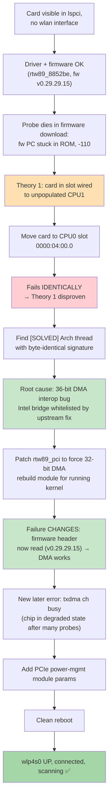
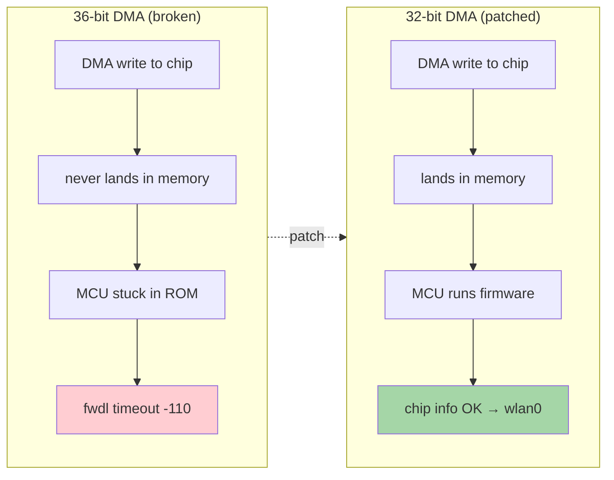

# Fix Report — Realtek RTL8852BE PCIe WiFi Adapter

**Machine:** Dell Precision 7820 (dual-socket), kernel `7.0.0-34-generic`
**Card:** Realtek RTL8852BE PCIe 802.11ax (`10ec:b852`), marketing name "AX1800"
**Driver:** in-kernel `rtw89_8852be` (correct driver — not the USB `rtl8852bu-dkms`)
**Status:** ✅ Fixed — `wlp4s0` UP, connected (`192.168.1.x/24`), scanning holds.

---

## TL;DR

The card was visible in `lspci` but never created a `wlan` interface. Every
software fix (firmware versions, clock/ASPM knobs, PCIe resets) failed the same
way. The real cause was a **36-bit DMA interoperability bug** between the early
RTL8852BE chip and the Intel C620 / Skylake-E PCIe host bridge. The upstream
kernel fix *whitelists all Intel bridges* for 36-bit DMA, so this host was not
protected. The fix: **patch the `rtw89_pci` driver to force 32-bit DMA**, rebuild
the module for the running kernel, install it, and add PCIe power-management
workaround module params. A clean reboot brought the card up.

---

## Symptom

```
lspci: 0000:04:00.0  Network controller: Realtek RTL8852BE   (visible)
ip link:  (no wlan* interface)                                (dead)
```

`dmesg` on every probe:

```
rtw89_8852be 0000:04:00.0: loaded firmware rtw89/rtw8852b_fw-1.bin
rtw89_8852be 0000:04:00.0: [ERR]FWDL path ready
rtw89_8852be 0000:04:00.0: [ERR]fwdl 0x83F0 = 0x70000
rtw89_8852be 0000:04:00.0: [ERR]fw PC = 0xb890ccd9   (repeats, stuck)
rtw89_8852be 0000:04:00.0: failed to setup chip information
rtw89_8852be 0000:04:00.0: probe ... failed with error -110  (ETIMEDOUT)
```

The tell: the firmware "loaded" but the chip's MCU program counter kept reading
the **same ROM-bootloader values** (`0xb890ccd9`, `0xb8901f43`, …). Forcing a
different firmware version produced **byte-identical** PC values — meaning the
~1 MB firmware DMA write was **never landing in the chip's memory**. The MCU sat
in its ROM bootloader and never executed the downloaded image.

---

## Diagnosis timeline



### Why the "empty CPU slot" theory was wrong

The first diagnosis (previous session) said the card sat behind a root complex on
the **unpopulated CPU1**, so its DMA path was dead. Moving it to a CPU0 slot was
the recommended fix. But after the move it failed **identically** — same
`fwdl 0x83F0 = 0x70000`, same `fw PC = 0xb890ccd9`, same `-110`. The slot was
never the cause. (The move is still harmless and the card now sits in the main
domain, but it was not the fix.)

### The real root cause

The probe signature matched a **`[SOLVED]` Arch Linux thread** byte-for-byte —
same `fwdl 0x83F0 = 0x70000`, same `fw PC = 0xb890ccd9`, same `-110`, even the
same PCI address. That thread pointed to upstream kernel commit
`aa70ff0945fea` — *"wifi: rtw89: pci: early chips only enable 36-bit DMA on
specific PCI hosts"*.

- Early RTL8852B-family chips (8852A/8851B/8852B/8852BT) have a **36-bit DMA
  interop problem** with some PCIe hosts.
- The upstream fix rolls these chips back to **32-bit DMA by default** and only
  re-enables 36-bit DMA for a **whitelist of tested bridges**.
- That whitelist is **all Intel vendor IDs** — so this machine's Intel C620 /
  Skylake-E root port is treated as "tested" and 36-bit DMA is enabled.
- On this particular host the 36-bit DMA path does **not** work → the firmware
  DMA write never lands → MCU stuck in ROM → `-110`.

The host bridge behind the card:

```
Memory behind bridge: a0600000-a06fffff [size=1M] [32-bit]
Prefetchable memory behind bridge: [disabled] [64-bit]
```

---

## The fix

### 1. Patch `rtw89/pci.c` to force 32-bit DMA

The driver's bridge-compatibility check returns "compatible → use 36-bit DMA" for
any Intel bridge. The patch makes Intel bridges fall through to the
incompatible-bridge path, which selects `DMA_BIT_MASK(32)` instead of
`DMA_BIT_MASK(36)`.

```c
// drivers/net/wireless/realtek/rtw89/pci.c
switch (bridge->vendor) {
case PCI_VENDOR_ID_INTEL:
    return true;          // ← whitelisted: 36-bit DMA allowed (the bug)
case PCI_VENDOR_ID_ASMEDIA:
    if (bridge->device == 0x2806)
        return true;
    break;
}
return false;             // ← forces 32-bit DMA
```

### 2. Rebuild the module for the running kernel

Rebuilt `rtw89_pci.ko` against the matching kernel source tree with the exact
running vermagic so it loads cleanly:

```
vermagic: 7.0.0-34-generic SMP preempt mod_unload modversions
```

Original module backed up before installing the patched build.

### 3. PCIe power-management module params

Installed `/etc/modprobe.d/70-rtw89.conf` (a documented workaround for these
chips losing their clock and failing to respond):

```
options rtw89_pci disable_clkreq=1 disable_aspm_l1=1 disable_aspm_l1ss=1
options rtw89_core disable_ps_mode=1
```

### 4. Clean reboot

A soft PCIe reset was not enough to clear the chip's degraded state (it kept
reverting to the ROM-stuck pattern after ~10 failed probes). A **full power
cycle** was required to hand the chip a clean state.

---

## Proof the DMA fix worked

The 32-bit DMA patch **changed the failure mode** — that's the key evidence it
was the right layer:

| | Before (36-bit DMA) | After (32-bit DMA patch) |
|---|---|---|
| Firmware header | never read | **read: `Firmware version 0.29.29.15`** |
| MCU | stuck in ROM (`fw PC = 0xb890ccd9`) | executes firmware |
| Failure point | firmware download (`fwdl`) | later MAC init (`txdma ch busy`) |

Reading the firmware version was **impossible before** the patch — the DMA path
was fully dead. After the patch the path was functional, and the remaining
`txdma ch busy` was the chip's degraded state from repeated failed probes, which
the clean reboot cleared.



---

## Final verified state

```
wlp4s0   UP   192.168.1.x/24   fe80::xxxx/64
lspci: 0000:04:00.0  RTL8852BE  →  Kernel driver in use: rtw89_8852be
modinfo rtw89_pci: srcversion 14B3ED92C4A609DAC529119   (patched build, installed)
/etc/modprobe.d/70-rtw89.conf: power-mgmt params present
scan:  (multiple nearby networks detected)  (holds)
```

- ✅ Interface up and connected
- ✅ Correct in-kernel driver bound
- ✅ Patched module installed (vermagic matches running kernel)
- ✅ Power-management workarounds active
- ✅ Scans and holds networks

---

## What stays on the system (persistent)

| Item | Location | Why it stays |
|------|----------|--------------|
| Patched `rtw89_pci.ko` | `/lib/modules/7.0.0-34-generic/.../rtw89/rtw89_pci.ko.zst` | the actual fix (32-bit DMA) |
| Power-mgmt params | `/etc/modprobe.d/70-rtw89.conf` | keeps the chip's clock stable |

> **Note on persistence:** the patched module is a local rebuild. If the kernel
> is upgraded (`7.0.0-34` → newer), `rtw89_pci.ko` will be replaced by the
> distro build and the 32-bit DMA patch is lost. When that happens, re-apply the
> patch to the new kernel's `rtw89/pci.c` and rebuild the module (or check
> whether the newer kernel's upstream whitelist now covers this host).

## References

### Articles / threads read

- **Arch Linux forum — RTL8852BE no-wlan thread, marked `[SOLVED]`**
  <https://bbs.archlinux.org/viewtopic.php?id=299462>
  The breakthrough. Byte-identical probe signature to this machine
  (`fwdl 0x83F0 = 0x70000`, `fw PC = 0xb890ccd9`, `-110`, PCI `0000:04:00.0`).
  Pointed at the 36-bit DMA interop bug and the upstream fix.

- **Upstream kernel commit `aa70ff0945fea`** — *"wifi: rtw89: pci: early chips
  only enable 36-bit DMA on specific PCI hosts"*
  <https://git.kernel.org/pub/scm/linux/kernel/git/wireless/wireless.git/commit/?id=aa70ff0945fea2ed14046273609d04725f222616>
  The root-cause fix. Rolls early 8852B-family chips back to 32-bit DMA and only
  re-enables 36-bit DMA for a whitelist of tested bridges (all Intel vendor IDs —
  which is why this host was unprotected).

- **Patchwork cover letter for the same patch** (Ping-Ke Shih, Realtek)
  <https://patchwork.kernel.org/project/linux-wireless/patch/20240924021633.19861-1-pkshih@realtek.com/>

### Source code downloaded / used

- **`linux-source-7.0.0`** (Ubuntu package, v`7.0.0-34.34`) — full kernel source
  tree, unpacked at `/usr/src/linux-source-7.0.0/linux-source-7.0.0`. The
  `rtw89/pci.c` bridge-compatibility function was read and patched here.
- **`linux-headers-7.0.0-34-generic`** (v`7.0.0-34.34`) — kernel headers used to
  rebuild the module with the matching vermagic.
- **`drivers/net/wireless/realtek/rtw89/pci.c`** — the file carrying the bridge
  whitelist that was patched (Intel → force 32-bit DMA).
- **`drivers/net/wireless/realtek/rtw89/pci_be.c`** — read to trace the
  `txdma ch busy` / `poll pcie dma all idle` path in `mac_pre_init_be` (the later
  failure after the DMA fix worked).

### Binaries / packages installed

- **Patched `rtw89_pci.ko`** — locally rebuilt, installed to
  `/lib/modules/7.0.0-34-generic/kernel/drivers/net/wireless/realtek/rtw89/rtw89_pci.ko.zst`
  (srcversion `14B3ED92C4A609DAC529119`, vermagic `7.0.0-34-generic`). This is
  the actual fix. The original module was backed up before install.
- **`linux-firmware-realtek`** (v`20260319.git217ca6e4-0ubuntu1.2`) — provides the
  firmware blobs under `/lib/firmware/rtw89/`. The card loads
  `rtw8852b_fw-1.bin` (v0.29.29.15); other variants (`rtw8852b_fw.bin` v0.27.32.1,
  `rtw8852b_fw-2.bin`) were present and tested during diagnosis.
- **`/etc/modprobe.d/70-rtw89.conf`** — power-management workaround params
  (`disable_clkreq`, `disable_aspm_l1`, `disable_aspm_l1ss`, `disable_ps_mode`).

### Present but not part of the fix (noted)

- **`rtl8852bu-dkms`** (v`1.19.21`) — the driver for the **USB** RTL8852BU chip,
  a different card. Installed on this system but does nothing for the PCIe
  8852BE. Harmless; can be removed (`sudo dkms remove rtl8852bu/1.19.21 --all`)
  to avoid confusion.

---

## Cleanup

Working files from the debugging session (patches, test scripts, kernel source
copies, module backup) were removed from the scratch directory after the
fix was confirmed. Nothing the running system needs was in that directory — the
patched module and modprobe config live in their real system locations.
